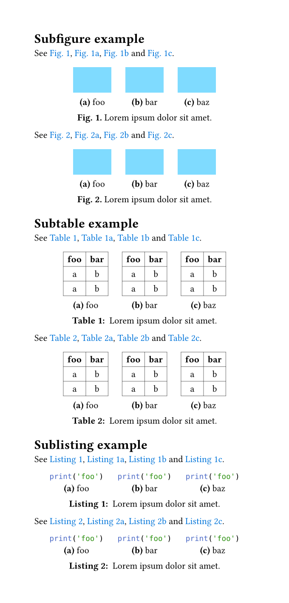

# hallon

A collection of utility functions for Typst.

## Named references example

See [example/example-nameref.typ](example/example-nameref.typ).

## Subfigures example

See [example/example-subfig.typ](example/example-subfig.typ).

See [example/example-subfig-headings.typ](example/example-subfig-headings.typ).

## Etymology

Hallon (`ˈhàlɔn`) means raspberry in Swedish, a befitting name for a package that contains *"lite smått och gott"*.
